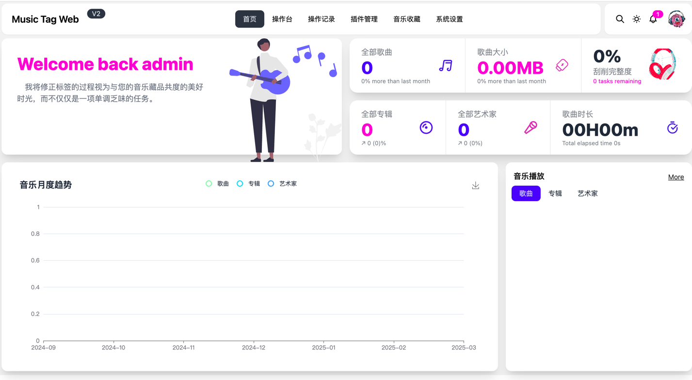
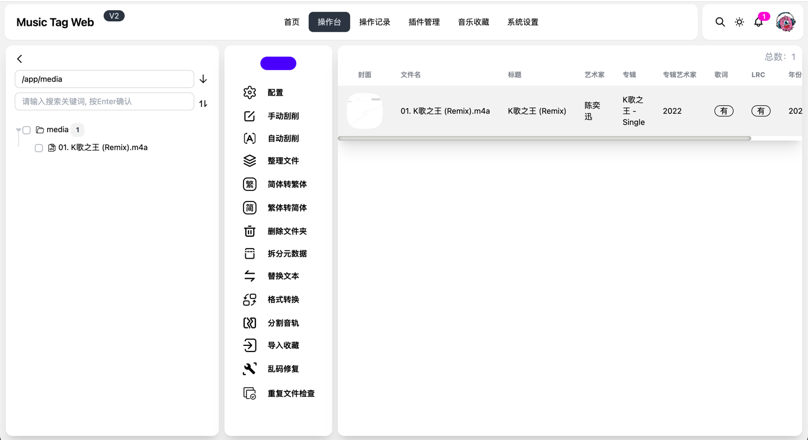
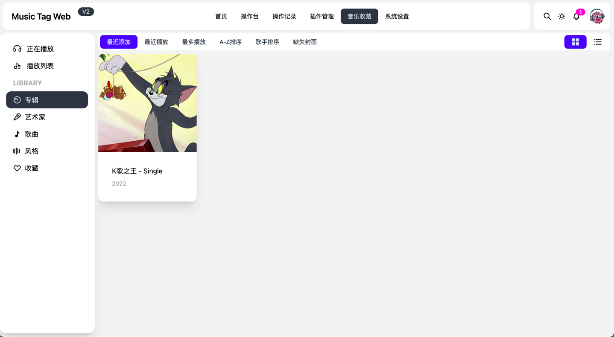
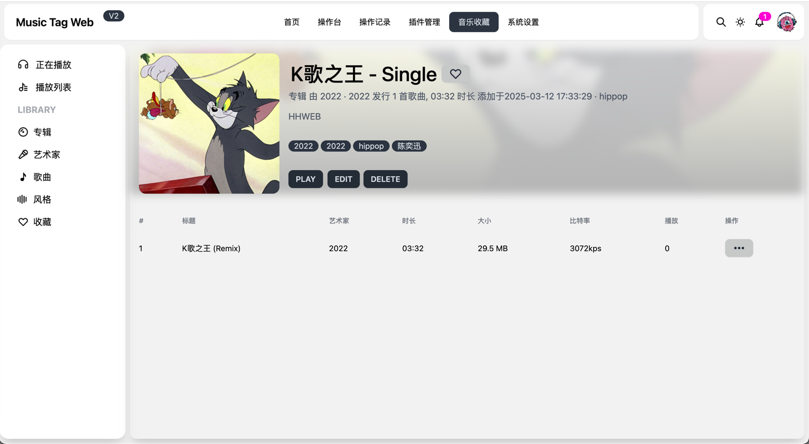
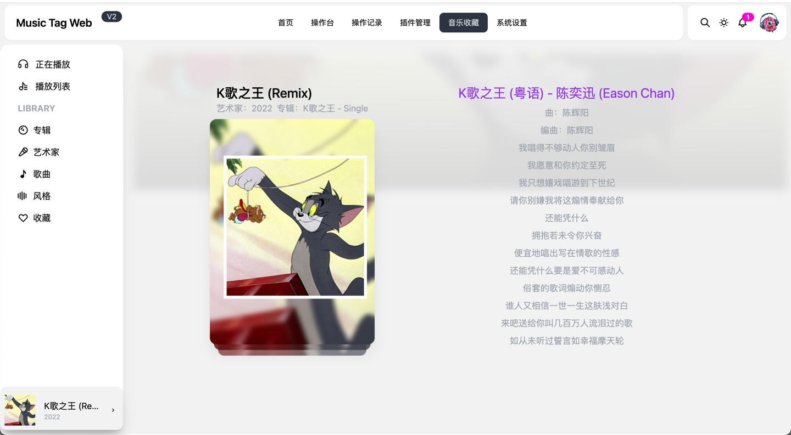
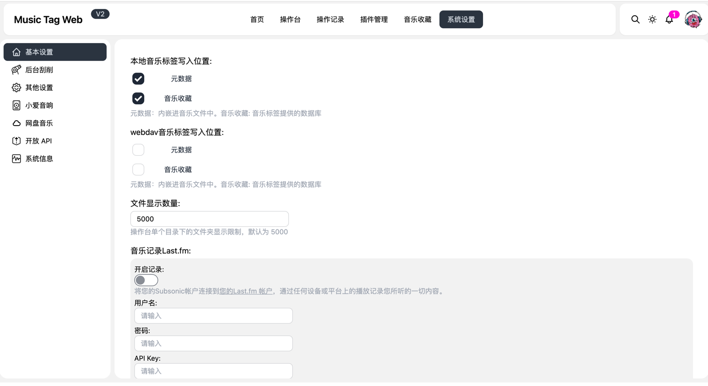

# 🚀 Music Tag Web | Self-hosted Docker 音乐刮削器 NAS无损曲库元数据批量管理工具
[简体中文](README.md) | [English](readme_en.md)

<a href="https://hellogithub.com/repository/d1919a26b74b40f19240da9f2ee3f7a3" target="_blank"></a>


## 项目简介
Music Tag Web 是一款**开源 self-hosted 自托管 Docker 音乐标签编辑器**，专为 NAS、远程影音服务器、Homelab 自建玩家打造，可在线编辑歌曲标题、专辑、艺术家、歌词、专辑封面等完整音频元数据，完美作为 Navidrome / Jellyfin 配套边车工具，替代本地 MP3Tag、MusicBrainz Picard。

支持 FLAC, APE, WAV, AIFF, WV, TTA, MP3, M4A, OGG, MPC, OPUS, WMA, DSF, MP4 全格式音频 ID3 标签批量编辑、刮削、修复整理，所有曲库文件本地存储不上传第三方，隐私安全，适配群晖、威联通、Linux 小主机 Docker 部署。
<div class="column" align="middle">
    <a href="https://www.python.org/downloads/"></a>
   
  
  
</div>

# 🎉 核心功能 Feature（Self-hosted Docker 专属优势）
为什么开发 Web 自托管版本？
很多自建 Navidrome / Jellyfin 的用户音乐文件存放在远程 NAS、Linux 服务器，本地 MP3Tag、MusicBrainz Picard 仅能操作本机文件，无法远程修改服务器无损曲库元数据。
Music Tag Web 采用 Docker 容器一键部署，作为影音服务配套边车应用，浏览器远程管理本地私有曲库，是 Homelab 影音爱好者刚需自托管音乐元数据工具。

- 全格式音频文件本地元数据查看、单条/批量编辑、修复 ID3 标签
- 批量自动刮削音乐标签，自动匹配专辑信息、艺术家、歌词、封面
- 内置音乐指纹识别，无标签、文件名混乱歌曲自动识别匹配元数据
- 智能整理本地音乐文件，按艺术家、专辑自动分组，支持自定义多级曲库分类
- 多维度文件排序：文件名、文件大小、文件更新时间
- 批量繁简转换，一键转换歌曲、专辑、艺术家标签简体/繁体
- 文件名拆分解包，自动从文件名提取缺失歌曲、歌手、专辑信息补全标签
- 批量文本替换，清理曲库脏标签、乱码、多余特殊字符
- 集成 ffmpeg，支持无损音乐格式批量转换
- 整轨 APE/FLAC/CUE 文件自动切割分轨并补全独立标签
- 多源音乐元数据接口，多渠道兜底刮削曲库信息
- 内嵌歌词翻译，批量双语歌词写入音频文件
- 完整操作日志记录，追溯标签修改记录
- 批量导出/自定义上传替换专辑封面
- 全响应式移动端 UI，手机浏览器远程访问 NAS 曲库改标签
- 适配小爱同学本地曲库播放，直接读取 NAS 无损音乐文件
- 兼容各类私人网盘挂载曲库在线播放与标签编辑
- 播放数据统计，柱形图、折线图可视化曲库播放记录


# 🦀 项目演示 Demo
在线演示地址（体验批量修改音乐标签、自托管Web端操作效果）
DEMO 地址账号密码为：admin/admin

[【音乐标签Web｜Music Tag Web 自托管Docker音乐元数据工具演示】](http://117.72.222.188:8002/#/)


# 💯 使用部署指南 How to Use
完整图文教程文档：
[【使用手册】](https://xiers-organization.gitbook.io/music-tag-web/)

[【使用手册V2（新版Docker部署推荐）】](https://xiers-organization.gitbook.io/music-tag-web-v2/)

> V2 为当前推荐部署方式，所有 NAS、Linux Homelab 用户优先使用手册 V2 部署！

## V1 旧版 Docker 容器部署方式
镜像已上传至 Docker Hub，支持 amd64 / arm64 架构群晖、威联通、树莓派设备一键安装：

### 1. 从Docker Hub拉取自托管音乐标签工具镜像
```bash
docker pull xhongc/music_tag_web:latest
```

### 2. 运行Docker容器镜像（挂载本地NAS音乐目录）
```bash
docker run -d -p 8001:8001 -v /path/to/your/music:/app/media -v /path/to/your/config:/app/data --restart=always xhongc/music_tag_web:latest
```
或者 使用 Portainer Stacks 可视化部署 docker compose（NAS用户常用）
   

```yaml
version: '3'

services:
  music-tag:
    image: xhongc/music_tag_web:latest
    container_name: music-tag-web
    ports:
      - "8001:8001"
    volumes:
      - /path/to/your/music:/app/media:rw
      - /path/to/your/config:/app/data
    command: /start
    restart: unless-stopped
```
> 重要说明：`/path/to/your/music` 替换为你的NAS/服务器本地音乐文件夹路径！`/path/to/your/config` 改为持久化配置文件路径！

3. 访问地址：127.0.0.1:8001/admin，默认账号密码 admin/admin，首次登录务必修改默认密码


## V2 新版推荐部署方式（主流 self-hosted 用户首选）
> V2 与 V1部署区别：容器内部服务端口调整为 8002，Docker Compose 部署移除 `command: /start` 配置，兼容性更好，适配绝大多数NAS系统

### 1. 拉取最新Docker镜像
```bash
docker pull xhongc/music_tag_web:latest
```

### 2. 一键运行容器命令
```bash
docker run -d -p 8002:8002 -v /path/to/your/music:/app/media -v /path/to/your/config:/app/data --restart=always xhongc/music_tag_web:latest
```
docker-compose.yml 完整配置（Portainer/群晖容器管理器直接复制使用）：
```yaml
version: '3'

services:
  music-tag:
    image: xhongc/music_tag_web:latest
    container_name: music-tag-web
    ports:
      - "8002:8002"
    volumes:
      - /path/to/your/music:/app/media:rw
      - /path/to/your/config:/app/data
    restart: unless-stopped
```
> 提示：`/path/to/your/music` 替换NAS本地无损曲库目录；`/path/to/your/config` 自定义配置持久化目录！

3. 本地访问地址：127.0.0.1:8002/admin，默认账号密码 admin/admin，上线前修改管理员密码


# 📷 V2 版本操作界面 User Interface
远程浏览器批量管理NAS音乐标签、刮削元数据、整理曲库完整界面展示








# 💬 交流与反馈 Contact me
如果你在 self-hosted Docker 部署、NAS目录挂载、Navidrome 联动、批量标签刮削过程中遇到报错、功能需求，欢迎先 Star 项目后提交 issues。
issue 回复延迟可加入社群交流部署踩坑、曲库整理技巧；也可添加作者微信：charlesnowed（备注：**Music Tag**），拉你进交流群。

<div>
  &nbsp;
</div>

## 官方发布&交流频道：
[t.me/music_tag_web](https://t.me/music_tag_web)

[MusicTag Web 自托管影音交流群](https://t.me/+oTffyBoNALM3Yzll)

QQ1群：55893996 （已满）

QQ2群：79502786（NAS/Docker影音自建玩家交流）

# 💸 赞助与支持
如果这款 self-hosted Docker 音乐标签工具帮你整理好了NAS无损曲库、解决Navidrome标签混乱问题，可以请作者喝杯咖啡。
您的支持是持续更新自托管功能、适配更多NAS设备的动力, 谢谢您! (｡･∀･)ﾉﾞ

[➡ 爱发电](https://ifdian.net/a/music-tag-web)

# 🌟 Star History
开源自托管音乐元数据工具项目增长趋势

[](https://star-history.com/#xhongc/music-tag-web&Date)

<!--
self-hosted, music tag editor, docker music metadata tool, NAS flac tagger, navidrome sidecar tag editor, jellyfin batch id3 editor, homelab music manager, 自托管音乐标签工具, docker音乐元数据编辑器, 群晖音乐批量改标签, 威联通无损曲库整理, 替代mp3tag网页版, 音乐指纹识别刮削标签, 本地私有曲库管理
-->

# 免责声明
禁止任何形式的商业用途，包括但不仅限于售卖/打赏/获利，不得使用本代码进行任何形式的牟利/贩卖/传播，再次强调仅供个人私下研究学习技术使用，**本自托管项目仅编辑本地已有音乐文件元数据，不提供下载音乐本体！**
本项目仅以纯粹的技术目的去学习研究，如有侵犯到任何人的合法权利，请致信408737515@qq.com，我将在第一时间修改删除相关代码，谢谢！

本项目基于 GPL V3.0 许可证发行，以下协议是对于 GPL V3.0 的补充，如有冲突，以以下协议为准。

词语约定：本协议中的“本项目”指music-tag-web项目；“使用者”指签署本协议的使用者；“官方音乐平台”指对本项目内置的包括酷我、网易云、QQ音乐、咪咕、酷狗音乐、酷我音乐等音乐源的官方平台统称；“版权数据”指包括但不限于图像、音频、名字、歌词等在内的他人拥有所属版权的数据。

本项目的数据来源原理是从各官方音乐平台的公开服务器中拉取数据，经过对数据简单地筛选与合并后进行展示，因此本项目不对数据的准确性负责。 使用本项目的过程中可能会产生版权数据，对于这些版权数据，本项目不拥有它们的所有权，为了避免造成侵权，使用者务必在24小时内清除使用本项目的过程中所产生的版权数据。 本项目内的官方音乐平台别名为本项目内对官方音乐平台的一个称呼，不包含恶意，如果官方音乐平台觉得不妥，可联系本项目更改或移除。 本项目内使用的部分包括但不限于字体、图片等资源来源于互联网，如果出现侵权可联系本项目移除。 由于使用本项目产生的包括由于本协议或由于使用或无法使用本项目而引起的任何性质的任何直接、间接、特殊、偶然或结果性损害（包括但不限于因商誉损失、停工、计算机故障或故障引起的损害赔偿，或任何及所有其他商业损害或损失）由使用者负责。 本项目完全免费，仅供个人私下小范围研究交流学习 python 技术使用, 且开源发布于 GitHub 面向全世界人用作对技术的学习交流，本项目不对项目内的技术可能存在违反当地法律法规的行为作保证，禁止在违反当地法律法规的情况下使用本项目，对于使用者在明知或不知当地法律法规不允许的情况下使用本项目所造成的任何违法违规行为由使用者承担，本项目不承担由此造成的任何直接、间接、特殊、偶然或结果性责任。 若你使用了本项目，将代表你接受以上协议。